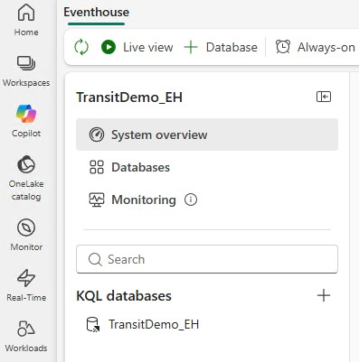
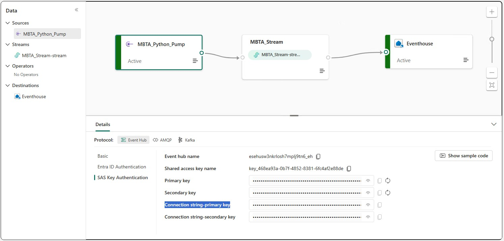
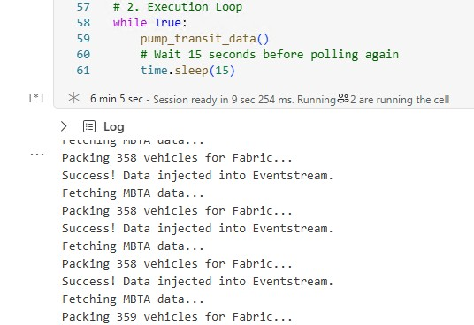
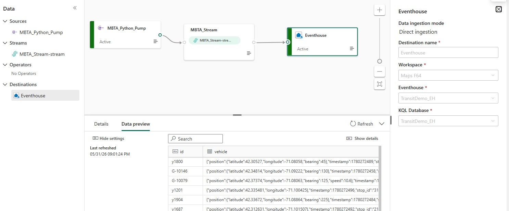
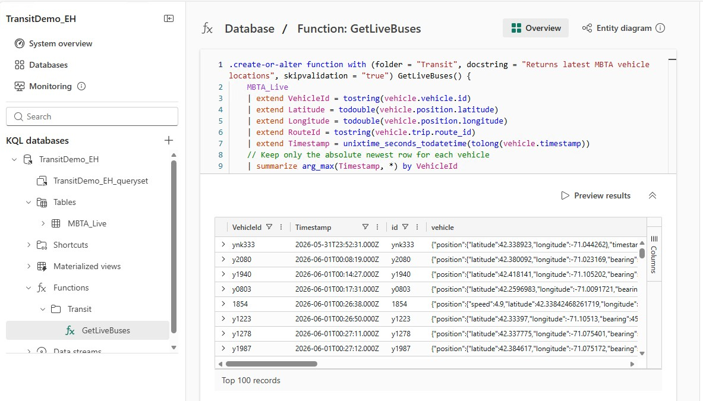
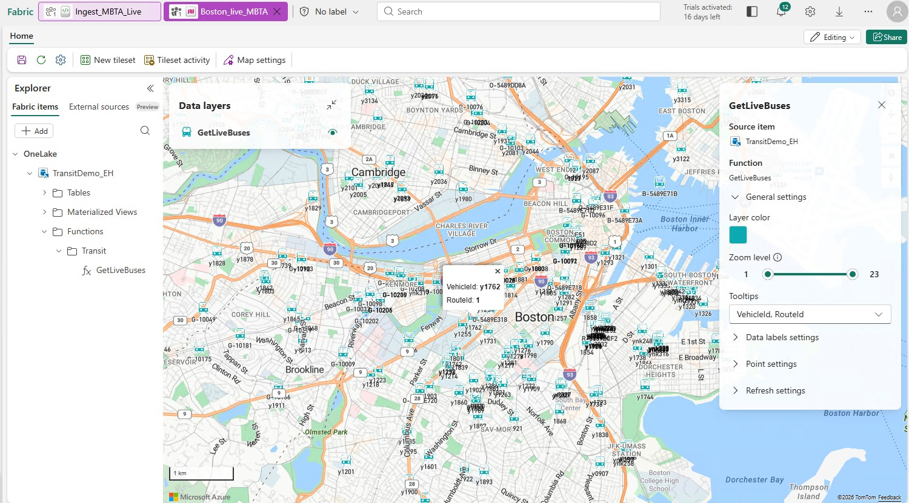

# Fabric Maps: Live MBTA Transit Map 
**Goal:** Ingest a live JSON GTFS-Realtime feed (MBTA Boston), stream it through Fabric Real-Time Intelligence, and render live, auto-updating vehicle locations on a Fabric Map.

---

## Step 1: Create the Eventhouse (Your Storage)
First, we need the database that will store the incoming transit data.

1. Open your Fabric Workspace and ensure your persona at the bottom left is set to **Real-Time Intelligence**.
2. Click **+ New** and select **Eventhouse**.
3. Name it `TransitDemo_EH` and click **Create**. 
4. Fabric will automatically create a KQL Database inside it. Leave it empty for now.




## Step 2: Create the Eventstream (Your Pipeline)
Next, build the endpoint that will catch the incoming data payloads.

1. Go back to your Workspace, click **+ New**, and select **Eventstream**. Name it `MBTA_Stream`.
2. In the Eventstream canvas, click **New source** and choose **Custom App**. Name it `MBTA_Python_Pump`.
3. Click on the new `MBTA_Python_Pump` node on the canvas. 
4. Look at the **Details** pane at the bottom. On the left side of that pane, click **SAS Key Authentication**.
5. Copy the **Connection string-primary key** (it will look like `Endpoint=sb://...`). You will need this in Step 3.




## Step 3: Start the Data Pump (Your Notebook)
We will use a Fabric Notebook to continuously pull the MBTA JSON feed and push it to your Eventstream via Azure Event Hubs.

1. Open a new tab in your Workspace, click **+ New**, and select **Notebook**.
2. Name the notebook `Ingest_MBTA_Live`.
3. Paste the following Python code into Cell 1.
4. **Crucial:** Paste your connection string from Step 2 into the `CONNECTION_STRING` variable.
5. Click **Run** (the play icon) and verify it prints "Success! Data injected...". Leave this tab running.

```python
%pip install azure-eventhub

import requests
import time
import json
from azure.eventhub import EventHubProducerClient, EventData

# 1. Define your endpoints
MBTA_URL = "[https://cdn.mbta.com/realtime/VehiclePositions.json](https://cdn.mbta.com/realtime/VehiclePositions.json)"
# PASTE YOUR CONNECTION STRING HERE
CONNECTION_STRING = "Endpoint=sb://YOUR_EVENTHUB_NAMESPACE.servicebus.windows.net/;SharedAccessKeyName=YOUR_KEY_NAME;SharedAccessKey=YOUR_KEY;EntityPath=YOUR_PATH"

def pump_transit_data():
    try:
        # Pull live data from MBTA
        print("Fetching MBTA data...")
        mbta_response = requests.get(MBTA_URL)
        mbta_response.raise_for_status()
        data = mbta_response.json()
        
        # Extract the array of vehicles
        vehicles = data.get("entity", [])
        
        if not vehicles:
            print("No vehicles found.")
            return

        print(f"Packing {len(vehicles)} vehicles for Fabric...")
        
        # Connect to Fabric Eventstream
        producer = EventHubProducerClient.from_connection_string(conn_str=CONNECTION_STRING)
        
        with producer:
            event_data_batch = producer.create_batch()
            
            for vehicle in vehicles:
                event_data = EventData(json.dumps(vehicle))
                try:
                    event_data_batch.add(event_data)
                except ValueError:
                    producer.send_batch(event_data_batch)
                    event_data_batch = producer.create_batch()
                    event_data_batch.add(event_data)
            
            if len(event_data_batch) > 0:
                producer.send_batch(event_data_batch)
                
        print("Success! Data injected into Eventstream.")

    except Exception as e:
        print(f"Error: {e}")

# 2. Execution Loop
while True:
    pump_transit_data()
    # Wait 15 seconds before polling again
    time.sleep(15) 
```

Here's what your notebook looks like while it's running. 
You'll see a steady stream of updates in the log underneath the code cell:



## Step 4: Route the Data and Auto-Create the Table
Connect the flowing Eventstream to your Eventhouse.

1. Go back to your **Eventstream** tab. 
2. Click **New destination** on the canvas and select **Eventhouse**.
3. In the configuration pane on the right:
   * **Data ingestion mode:** Change this to **Direct ingestion**.
   * **Eventhouse / KQL Database:** Select `TransitDemo_EH`.
   * Check the box for **"Activate ingestion after adding the data source"**.
4. **Crucial UI Step:** At the top of your Fabric screen, click **Publish**. Wait for it to switch from Edit mode to Live mode.
5. Click on your Eventhouse destination node and click **Activate** (or open the Get Data wizard).
6. Now you can name your KQL Destination table: `MBTA_Live`. Click Next.
7. In the data inspector, ensure **Nested levels** is set to **1**. You should see the raw JSON. Click **Finish**. Data is now landing in your database.


Here is the new Eventhouse configuration (on the right): 



## Step 5: Create the Kusto Function
Instead of writing a complex query directly in the map visual, we save the parsing logic in the database as a Stored Function. 

1. Go to your Workspace and open your `TransitDemo_EH` KQL Database.
2. Click **Explore your data** or open a new **KQL Queryset**.
3. Paste the following command into the query editor and click **Run**:
4. Notice that the Queryset is creating the Function - Fabric Maps no longer visualizes querysets, it visualizes functions.
5. In the next step you will add the function as a map layer

```kusto
.create-or-alter function with (docstring = "Returns latest MBTA vehicle locations", folder = "Transit") GetLiveBuses() {
    MBTA_Live
    | extend VehicleId = tostring(vehicle.vehicle.id)
    | extend Latitude = todouble(vehicle.position.latitude)
    | extend Longitude = todouble(vehicle.position.longitude)
    | extend RouteId = tostring(vehicle.trip.route_id)
    | extend Timestamp = unixtime_seconds_todatetime(tolong(vehicle.timestamp))
    // Keep only the absolute newest row for each vehicle
    | summarize arg_max(Timestamp, *) by VehicleId
    // Filter out missing GPS
    | where isnotnull(Latitude) and isnotnull(Longitude)
}
```



## Step 6: Build the Fabric Map
Connect the spatial visual directly to your new function.

1. Go to your Workspace, click **+ New**, and select **Map**.
2. Once the map canvas opens, click **Add layer** -> **Point layer**.
3. For the **Data Source**, select **Eventhouse** and connect it to your `TransitDemo_EH` database.
4. When prompted for the query or table, simply enter your function name:
   `GetLiveBuses()`
5. Map your coordinates in the layer settings:
   * **Latitude:** `Latitude`
   * **Longitude:** `Longitude`
   * **Tooltip/Label:** `RouteId` (or `VehicleId`)
6. Click the **Layer Settings** (gear icon) and enable **Auto-refresh**, setting it to **15 seconds**.

**Note:** Remember to stop the Python notebook cell from running (using the Stop/Cancel button) when your demo is complete to conserve Fabric compute capacity!



